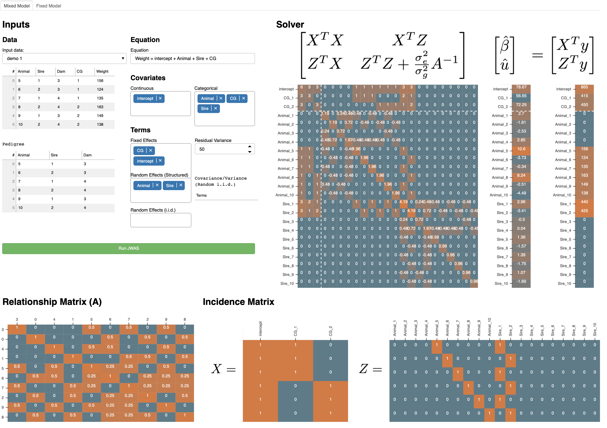

# LMMonBoard

App link: [https://lmmonboard.ucdavis.edu/](https://lmmonboard.ucdavis.edu/)



## Installation

### Install [Julia 1.5.4](https://julialang.org/downloads/oldreleases/) and [Python 3](https://www.python.org/downloads/).
It's noted that `Teach_LMM` currently doesn't support the latest Julia 1.6.

### **In Shell**: Create an alias for Julia to PATH (Assuming a MacOS user and Julia 1.5)
``` Bash
ln -s /Applications/Julia-1.5.app/Contents/Resources/julia/bin/julia /usr/local/bin/julia
```

### **In Shell**: Install dependecies for Python3
``` Bash
# Download Teach_LMM
git clone https://github.com/Poissonfish/Teach_LMM

# Install dependencies
python3 -m pip install bokeh numpy pandas julia
```

### **In Julia**: Install dependecies for Julia
``` Julia
using Pkg
Pkg.add(["JWAS", "CSV"])
```

### **In Python3**: Setup PyJulia in Python3
``` Python
import julia
julia.install()
```

## Launch App
In shell, navigate to the folder `Teach_LMM` and run Bokeh 
``` Bash
cd Teach_LMM
bokeh serve --show myapp 
```
