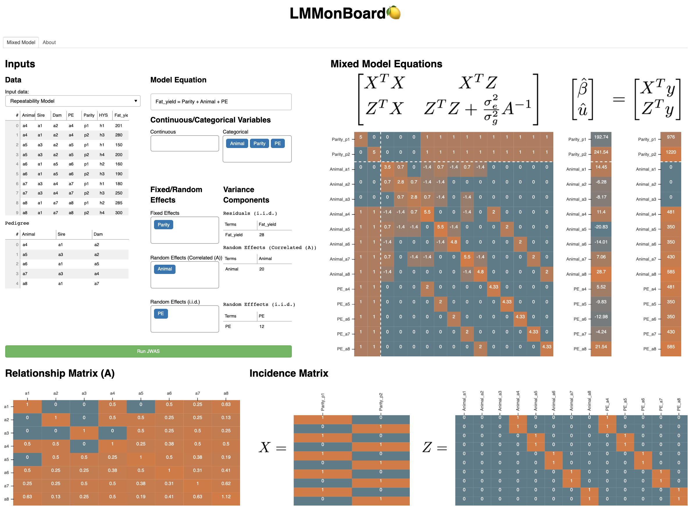
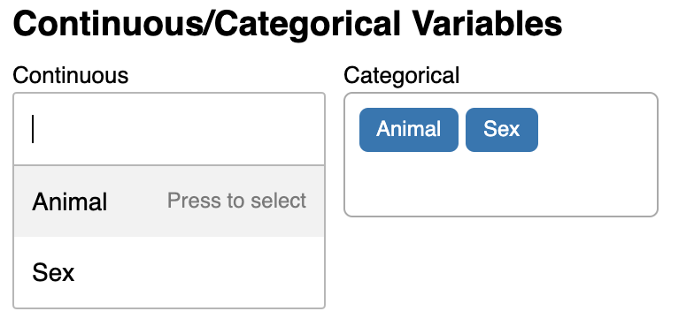
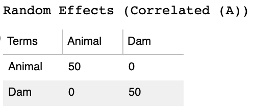

# Summary

# Statement of need
Linear mixed models (LMM) are statistical approaches
widely deployed to model the relationship between observed factors and quantitative traits
in both plant and animal breeding.
It's because in general linear models, assumptions of homogeneous variance among
individuals are likely to be violated in practical breeding population,
which contain inevitable stratification.
Pedigree, genders, herds, or maternal effects are factors
easily confounding with traits of interest,
and such false connections can lead to spurious significant signals
in genome-wide association studies or biased estimations of breeding values.
Whereas LMM can adequately fit those heterogeneous variances into models,
reducing the deviation from real-world settings,
and improving the accuracy in evaluating quantitative traits.

As LMM is essentially important to genetics research,
efforts have been made to distribute the knowledge
by hosting short courses or releasing software.
[Summer Institute in Statistical Genetics](https://si.biostat.washington.edu/suminst/sisg)
is a well-known example that covers multiple crucial topics in biostatistics
and has been hosted for more than 20 years.
Participants from different disciplines can connect with potential collaborators
or enhance their research with newly learned ideas.
On the other hand, computational software is released to facilitate the implementation of LMM.
DMU [@madsen_dmu_2006], nlme [@pinheiro_nlme_2021],
lme4 [@bates_fitting_2015], BGLR [@perez_genome-wide_2014],
and JWAS [@cheng_jwas_2018] are example software
that is actively used in the biostatistics community.
With proper efforts, these versatile tools can adapt to most breeding schemes
involved complicated variance structures.
However, there are gaps still existing between students and LMM theories await to be bridged.
For example, most teaching materials provided in short courses are static slides
with limited hands-on programming codes.
It's difficult for students, in a short time, to modify codes and verify the theory
from existing examples to new ones.
In addition, most computational tools focus on visualizing outputs,
but rarely address the inputs information such as matrix dimension,
or additive genetic relationship matrix, which is equally important.
Students who are new to LMM theories may have risks falsely defining
incidence matrices without awareness as the software could still return results
regardless of the equation validity.

Hence, in this study, we present an interactive dashboard, LMMonBoard,
as a teaching tool for biostatistics community.
Datasets are selected from [@mrode_linear_2013] to demonstrate essential models
including animal models, common environment models, repeatability models, and maternal effect models.
LMMonBoard addresses the described concerns by:
* Allowing users to modify datasets or parameters and showing updated results.
* Visualizing both input and output matrices in LMM equations

The application and instruction can be found on the [notion page](https://www.notion.so/LMMonBoard-3ce6dbe26c374b93808dc15fee94ea86)

# Implementation

LMMonBoard (\autoref{fig_overview}) is written in Python 3 and
is implemented in a Python Bokeh application [@bokeh_development_team_bokeh_2018]
which provides friendly graphical user interfaces.
As for the backend engine, Julia JWAS [@cheng_jwas_2018] solves LMM equations defined from users
and returns solutions and matrix information back to Bokeh for the visualization.
The communication between Python and Julia is realized by PyJulia [@takafumi_arakaki_juliapypyjulia_2020].
PyJulia launches a JULIA real-eval-print loop (REPL) session on the startup of LMMonBoard
and pre-compiles JWAS functions in the background.
The mechanisms greatly shorten every follow-up computation time and
bring a better user experience with instant feedback.

# Datasets
Available datasets are examples in @mrode_linear_2013
and are named for the demonstrated models including
animal model,
repeatability model,
common environment model,
and maternal effect model.
Each dataset contains phenotypic data (\autoref{fig_overview})
and pedigree data (\autoref{fig_overview}).
The phenotypic data records the studied trait and trial factors,
such as maternal effects or herbs effects.
And the pedigree data includes the ancestor information (i.e., sire and dam) of
the observed individuals for defining the population structure.
All table cells are editable and the results can be updated accordingly.

# Equations
The equation can be intuitively defined by factor names and math operators (\autoref{fig_overview}c).
The term on the left-hand side of the equation is considered as response variables,
and terms concatenated by plus signs are LMM regressors.

# Fixed, random terms, and their variances
Users can define whether the terms are categorical or not.
By default, all terms found in the equation are assigned to the categorical section.
Users can interact with the section with mouse clicks to re-assign specific term to continuous variables (\autoref{fig_CatCon}).
All variables are assumed to be fixed effects.
Users can also freely define variables as fixed, correlated random, or i.i.d. random effects in the same manner (\autoref{fig_overview}d).

Variances determine how correlated between each factor and how heritable the modeled trait is.
the default variances are found from @mrode_linear_2013, but users can modify them as users' desire.
Available editable variance-covariance matrices are residual, correlated random effects, and i.i.d. random effects.
And the dimension of each matrix can be dynamically changed based on the number of corresponding random factors (\autoref{fig_var}).

{ width=80% }

# Visualizations
The incidence matrices,
relationship matrix,
and the mixed model equation are visualized in heatmaps colored from blue to orange
showing the relative values of each section.
Sections in the left-hand-side (LHS) matrices are defined and scaled by $X^TX, X^TZ, Z^TX$ and $Z^TZ + \sigma^2_e / \sigma^2_g A^{-1}$
and are separated by white-dashed line.
And sections on the right-hand-side (RHS) and the solution vectors are separated based on whether the term is related to fixed or random effects (\autoref{fig_overview}e).
The relationship matrix (A) (\autoref{fig_overview}f) is derived from the input pedigree, and the axis tickers are labeled by individual names
The incidence matrices (\autoref{fig_overview}g) has factor names followed by factor levels labeled on the topper area of x-axis.

{ width=80% }

# Conclusion
LMMonBoard is a dashboard allowing students understand LMM in
an interactive, creative ways.
Editable inputs environment enables students to verify their understanding in newly defined cases,
and students can easily adapt the existing example to any schemes by modify input data or LMM equation.
It's also easier for students to understand matrix contents with
the visualization of incidence matrices and solution matrices, students
can have better overview of LMM by observing the connection between input parameters and the numerical patterns in the matrices.
Overall, LMMonBoard can be helpful to strengthen students' understanding on LMM in the teaching scenarios.

# Acknowledgements

# References
